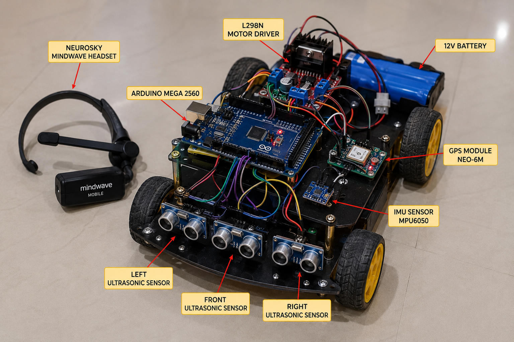

# 🧠 BCI-Based Autonomous Vehicle using Arduino Mega


## 🚀 Overview

A Brain-Computer Interface (BCI) Assisted Autonomous Vehicle that combines EEG brain signal processing, autonomous navigation, obstacle avoidance, GPS tracking, and embedded control systems.

The vehicle receives high-level commands from a NeuroSky MindWave headset while maintaining safe autonomous operation through onboard sensors.

---

## 🎯 Key Features

### 🧠 Brain-Controlled Commands

- Forward Movement
- Left Turn
- Right Turn
- Stop Vehicle

### 🤖 Autonomous Features

- Obstacle Detection
- Obstacle Avoidance
- Collision Prevention
- Autonomous Navigation

### 📡 Sensor Integration

- EEG Signal Acquisition
- Ultrasonic Distance Sensing
- IMU Orientation Tracking
- GPS Position Monitoring

---

## 🏗 System Architecture

```text
Human Brain
     │
     ▼
NeuroSky MindWave
     │
     ▼
Brain Signal Processing
     │
     ▼
Command Generation
     │
     ▼
Arduino Mega
     │
 ┌───┼───────────────┐
 ▼   ▼               ▼
GPS MPU6050     Ultrasonic Array
 │    │               │
 └────┴───────────────┘
          │
          ▼
 Autonomous Decision Layer
          │
          ▼
      L298N Driver
          │
          ▼
      DC Motors
```

---

# 🔧 Hardware Components

| Component                 | Quantity |
| ------------------------- | -------- |
| Arduino Mega 2560         | 1        |
| NeuroSky MindWave Mobile  | 1        |
| HC-SR04 Ultrasonic Sensor | 3        |
| MPU6050 IMU               | 1        |
| NEO-6M GPS Module         | 1        |
| L298N Motor Driver        | 1        |
| DC Geared Motors          | 4        |
| 12V Battery               | 1        |
| Buck Converter (5V)       | 1        |
| Robot Chassis             | 1        |

---

# 🔌 Wiring Connections

## Ultrasonic Sensors

| Sensor | Trigger Pin | Echo Pin |
| ------ | ----------- | -------- |
| Front  | D2          | D3       |
| Left   | D4          | D5       |
| Right  | D6          | D7       |

## Motor Driver

| L298N | Arduino Mega |
| ----- | ------------ |
| IN1   | D8           |
| IN2   | D9           |
| IN3   | D12          |
| IN4   | D13          |
| ENA   | D10          |
| ENB   | D11          |

## MPU6050

| MPU6050 | Arduino |
| ------- | ------- |
| SDA     | A4      |
| SCL     | A5      |
| VCC     | 5V      |
| GND     | GND     |

## GPS Module

| GPS Module | Arduino  |
| ---------- | -------- |
| TX         | RX1 (19) |
| RX         | TX1 (18) |
| VCC        | 5V       |
| GND        | GND      |

## NeuroSky MindWave

| MindWave | Arduino |
| -------- | ------- |
| TX       | RX1     |
| RX       | TX1     |
| VCC      | 5V      |
| GND      | GND     |

---

# 📂 Project Structure

```text
BCI_Autonomous_Vehicle/
│
├── firmware/
│   ├── main/
│   │   └── main.ino
│   │
│   ├── config/
│   │   ├── pins.h
│   │   ├── constants.h
│   │   └── vehicle_config.h
│   │
│   ├── bci/
│   │   ├── bci.h
│   │   └── bci.cpp
│   │
│   ├── motor/
│   │   ├── motor.h
│   │   └── motor.cpp
│   │
│   ├── ultrasonic/
│   │   ├── ultrasonic.h
│   │   └── ultrasonic.cpp
│   │
│   ├── imu/
│   │   ├── imu.h
│   │   └── imu.cpp
│   │
│   ├── gps/
│   │   ├── gps.h
│   │   └── gps.cpp
│   │
│   ├── navigation/
│   │   ├── navigation.h
│   │   └── navigation.cpp
│   │
│   ├── autonomous/
│   │   ├── obstacle_avoidance.h
│   │   └── obstacle_avoidance.cpp
│   │
│   └── communication/
│       ├── serial_protocol.h
│       └── serial_protocol.cpp
│
├── docs/
│   ├── architecture.png
│   ├── wiring_diagram.png
│   └── flowchart.png
│
├── images/
│   ├── system_design.png
│   ├── circuit_diagram.png
│   └── prototype.png
│
├── README.md
│
└── LICENSE
```

---

# 🧮 Mathematical Model

## Ultrasonic Distance Calculation

\[
Distance = \frac{SpeedOfSound \times Time}{2}
\]

```math
d = (v × t)/2
```

---

## Differential Drive Kinematics

```math
v = r(ωR + ωL)/2
```

```math
ω = r(ωR - ωL)/L
```

Where:

- r = Wheel Radius
- L = Wheel Base
- ωR = Right Wheel Speed
- ωL = Left Wheel Speed

---

# 🧠 Brain Signal Mapping

| Brain Signal    | Action       |
| --------------- | ------------ |
| Attention > 70  | Move Forward |
| Blink Once      | Turn Left    |
| Blink Twice     | Turn Right   |
| Meditation > 80 | Stop Vehicle |

---

# 🤖 Obstacle Avoidance Logic

```cpp
if(frontDistance < 30)
{
    if(leftDistance > rightDistance)
        turnLeft();
    else
        turnRight();
}
else
{
    moveForward();
}
```

---

# 🚀 Getting Started

## Clone Repository

```bash
git clone https://github.com/yourusername/BCI-Autonomous-Vehicle.git
```

## Open Project

```bash
Arduino IDE
```

Open:

```text
firmware/main/main.ino
```

Upload to:

```text
Arduino Mega 2560
```

---

# 📊 Future Improvements

- Real NeuroSky Packet Decoding
- ESP32 Migration
- ROS2 Integration
- SLAM Mapping
- Computer Vision
- YOLO Object Detection
- Autonomous Path Planning
- Reinforcement Learning Navigation

---

# 📸 Project Images

## System Architecture


## Circuit Diagram


## Prototype



---

# 🛡 Applications

- Brain-Controlled Wheelchair
- Smart Mobility Systems
- Human-Robot Interaction
- Assistive Technology
- Autonomous Ground Vehicles
- Research Platforms
- Defense Surveillance Robots

---

# 👨‍💻 Author

**Shivam Singh**

Embedded Systems | Robotics | AI | Computer Vision | Autonomous Systems

---

# ⭐ Support

If you found this project useful:

⭐ Star the Repository

🍴 Fork the Project

📢 Share with the Robotics Community

---

## License


## 📜 License

This project is licensed under the MIT License - see the [LICENSE](LICENSE) file for details.
